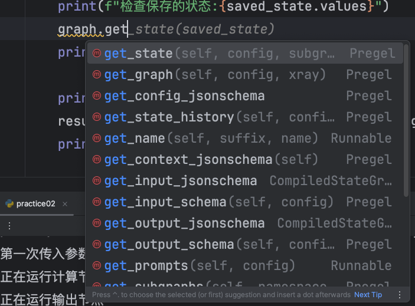

### 1. checkpoint 和 checkpointer 有什么区别？
Checkpoint 是“保存下来的状态快照”；Checkpointer 是“负责保存、读取这些快照的组件”。

LangGraph 官方也是这么定义的：某个时间点的线程状态叫 checkpoint，
而 checkpointer 负责把这些 checkpoints 持久化下来，并根据 thread_id 存取它们。

```angular2html
memory = InMemorySaver()

graph = builder.compile(
    checkpointer=memory
)
```
memory 就是 checkpointer。 它相当于一个“档案管理员”：

```angular2html
State
= 当前正在流转的数据
Checkpoint
= 某一时刻保存下来的 State 快照
Checkpointer
= 负责保存和读取 Checkpoint 的组件
thread_id
= 用来区分“这是谁的这一条执行线程”
```


### 2. 两次执行的区别
LangGraph 的 checkpointer 会按照 thread_id 保存和定位这个线程的 checkpoint；
官方把 thread_id 描述为定位持久化线程状态的关键标识。

```angular17html
第一次

thread01
   ↓
x = 4
   ↓
node_calc
x = 8
   ↓
node_output
   ↓
END
   ↓
Checkpoint
{
    x: 8,
    steps: [...]
}

然后：

第二次

invoke(None)
    +
thread_id = thread01
       ↓
找到 thread01 的 checkpoint
       ↓
恢复之前保存的 State
       ↓
当前已经处于 END
       ↓
返回保存的结果

因此这道练习里，第二次不应该重新打印：
```

### 3. 关于 graph.get
在代码内就能看到有很多的属性
checkpoint 的属性可以去源码看，也可以去书上看几个常用的
